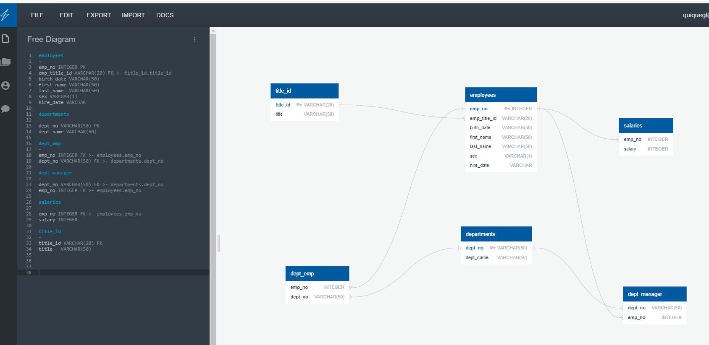

# SQL Homework - Employee Database: A Mystery in Two Parts

## Background

Research project on employees of the corporation from the 1980s and 1990s. All that remain of the database of employees from that period are six CSV files. The goal is to run queries based on those six CSV files

### Step 1

Create tables in Free Diagram tool by specifying data types, primary keys, foreign keys, and other constraints. 

Relationship need to be established because it will make it easier to join tables.

### Step 2

In Postgress (PG Admin), import CSV files into into Employee database 

### Step 3

Once the database is complete, we write a query to select the following information from the database. Queries are saved in a file called `queries.sql`:

### Tool used

 Quick_Diagrams 
  

 SQL_language 
  

### Links

[Diagram](https://app.quickdatabasediagrams.com/#/d/PenHwe)

